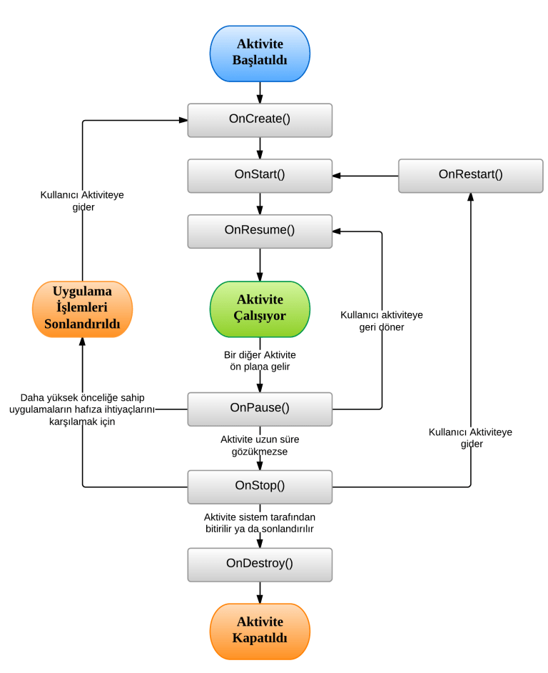

# Hafta 1 
<br>
<h2>Android Nedir</h2>

- Andorid, linux çekirdeği üzerine geliştirilmiş açık kaynak kodlu işletim sistemidir.

- Mobil (taşınabilir) cihazlar hedeflenmiştir.

- Google ve Open Handset Alliance birliği tarafından geliştirilmektedir. <br><br>

<h2>Android'in Mimari Yapısı</h2>

<h4>Applications :</h4> Kullanıcı ile etkileşim sağlanan katmandır. Bildiğimiz, kullandığımız uygulamalar bu katmanda yer alır. Örneğin instagram,whatsapp,browser...

<h4>Application Framework :</h4> Bir üst katmandaki uygulamalarımızın çalışması için gerekli kütüphaneler topluluğudur. Uygulamalarımızı geliştirmek için bu kütüphanleri kullanırız.

<h4>Libraries :</h4> C ile yazılmış sistem kütüphanleridir. Örneğin SQLite local bir veritabanı oluşturma imkanı tanır. Opengl/es grafik işlemleri için gerekli kütüphanedir.

<h4>Android Runtime :</h4> Java ile yazılmış çekirdek kütüphaneler ve işletim sistemini donanımdan ayıran sanal makine bulunur.

<h4>Linux Kernel :</h4> Android mimarisinin en alt katmanıdır. Donanım sürücüleri burada bulunur. Örneğin kamera sürücüsü , güç yönetimi... <br><br>

<h2>Bilinmesi Gerekenler</h2>

<h4>Xml</h4>

- Android'te tasarım ve veri kaynağı olarak xml(extensible markup language) kullanılır.
- Xml veri taşıma standardıdır.(farklı sistemler arasında ortak dil olarak kullanılır)
- Aynı zamanda bir işaretleme,görüntüleme dilidir. (Android'te bu amaçla kullanılır)
- Xml ile kendi etiketlerimizi (tag) oluşturabiliriz. (Android için kullanılan etiketler bu sayede tanımlanmıştır)
- Her xml dosyasında sadece bir kök(root) eleman bulunabilir. Bu kök içerisinde aynı düzeyde elemanlar tanımlanabilir.

<h4>Java</h4>

- Andorid'te tasarımlara işlev kazandırmak içim java pogramlama dili kullanılır. Alternatif : kotlin

**xml ile java kodları arasındaki bağlantı R.java konfigürasyon dosyası üzerinden sağlanır.**

**Not :** Java ile android uygulamalar geliştirebilmek için jdk(java development kit) ve android sdk(software developtment kit) sistemde kurulu olmalıdır.

Uygulamımızı yazmadan önce klasörler hakkında ön bilgi verelim.

## 1- src Klasörü
Burada src, kaynak (source) kelimesinin kısaltılması olarak kullanılmıştır. Bu klasör içerisinde, projemiz için gerekli olan kaynak kodlar / dosyalar yer almaktadır. Kaynak kodlar, uygulamamızın temelidir. Uygulamamız için gerekli bütün işlemleri bu dosyalar ile gerçekleştirebiliyoruz. Burada yer alan dosyalar .java uzantılı dosyalar olup Java dili kullanılarak yazılan kodlardan oluşur.

## 2- gen Klasörü
Bu klasör içerisindeki dosyalar, sistem tarafından otomatik olarak oluşturulur. Gen ismi de, oluşturulan (generated) kelimesinin kısaltmasıdır.

## 3- R.java Dosyası
gen klasörü içerisinde yer alan bu dosya, yukarıda da belirttiğim gibi sistem tarafından oluşturulan bir dosyadır. res klasörünün içerisine oluşturduğumuz tüm kaynakların referansları bu dosyada yer alır. Oluşturduğumuz kaynakları bu referanslar sayesinde kullanabiliriz. Bu sebeple bu referanslar res klasörü içerisinde yer alan her kaynak için otomatik olarak üretilir. Bu dosyaya dışarıdan müdahale edilmemesi önerilir.

## 4- assets Klasörü
Bu klasörde, android tarafından tanınmayan verilerin tutulduğu dosyalar yer alır. Android platformu bu tür kaynakları tanımadığından dolayı R.java dosyası içerisinde herhangi bir referans  üretilmez. Burada bulunan dosyalar uygulama paketi içerisinde yer alırlar. Örneğin; bir sqLite dosyasını uygulamanızda kullanmak istiyorsanız, bu dosyayı assets klasörü içerisine koymalısınız. Bu tür verilere, kodunuz içerisinde AssetsManager sınıfını ve getAssets() metodunu kullanarak ulaşabilirsiniz.

## 5- bin Klasörü
Bu klasör, uygulamanızın derlenmiş halini içerisinde bulundurur. Sizin bu klasöre başlangıç aşamasında iseniz müdahale etmenize gerek yoktur.

## 6- libs Klasörü
Bu klasör, adından da anlaşılacağı gibi kütüphanelerin(libraries) koyulduğu klasördür. Android SDK içerisinde yer almayan ve projenizde kullanmak istediğiniz java kütüphanelerini bu klasör içerisine kopyalayabilirsiniz.

.jar uzantılı bu kütüphaneleri libs klasörü içerisine kopyaladıktan sonra dosyaya sağ tıklayıp Add to Build Path seçeneğini seçmelisiniz. Aksi taktirde kütüphaneniz proje tarafından tanınmaz.

## 7- res Klasörü
res, kaynaklar (resources) kelimesinin kısaltmasıdır. Projeniz için gerekli kaynaklar burada yer almalıdır. Burada yer alan kaynaklar, platform tarafından tanınan kaynaklardır ve bu kaynaklar için R.java dosyası içerisinde referanslar üretilir. Bu sayede kodlarınız arasından bu kaynaklara rahat bir şekilde ulaşabilirsiniz.

## 7.1- drawable Klasörleri
Bu klasörler, uygulamanızda kullanmak istediğiniz resimleri koymanız içindir. Uygulamalarınızın kullanılacağı cihazların çözünürlükleri farklı olacağından farklı boyutlarda resimler koymanız gerekmektedir. Bu sebeple drawable klasörü bir tane değildir. Farklı çözünürlüklere uygun klasörler mevcuttur. klasörlerin yanında yer alan; ldpi, hdpi, mdpi, xdpi, xxdpi gibi ifadeler boyutları belirmektedir. ldpi; küçük, mdpi; orta, hdpi; büyük, xdpi; daha büyük, xxdpi; çok daha büyük resimleri ifade etmektedir. Ekran çözünürlükleri arttıkça bu klasörlerin sayısıda artmaktadır.

## 7.2- layout Klasörleri
Bu klasör içerisinde ise, oluşturacağınız ekranlar için tasarımlar hazırlayacağınız xml dosyaları yer almaktadır.

## 7.3- values Klasörleri
Uygulama içerisinde kullanmak istediğiniz sabit değişkenleri, bu klasör içerisinde tutabilirsiniz. Örneğin, bir string’i bu klasör içerinde yer alan string.xml dosyası içerisinde tanımlarsanız, o string’i istediğiniz yerde kullanabilirsiniz ve değiştirmek istediğinizde tek bir yerden değiştirmeniz yeterli olur.
<br><br>
> Not: Kod içerisinden buradaki değişkenlerin değerini değiştiremezsiniz.
<br><br>

## 8- AndroidManifest Dosyası
Bu dosyayı uygulanızın bir taslağı olarak düşünebilirsiniz. Uygulamanızda kullanacağınız bütün ekranların burada tanımlanması gerekmektedir. Ayrıca uygulamanızın bütün özellikleri burada tanımlıdır. Uygulamanızın kullanılacağı cihazlardan isteyeceği izinler de burada tanımlanmalıdır. Bunların nasıl yapılacağına, ayrıntılı bir şekilde ilerleyen yazılarım içerisinde yer vereceğim. Örnek olarak aşağıdaki dosyayı inceleyebilirsiniz.

<br>

Uygulamanızı kodlamaya başladığınızda ilk olarak bir ekran oluşturmak isteyeceksiniz. Activity sınıfları da oluşturmak istediğiniz ekranlara karşılık gelen sınıflardır. Aktivitelerin çalışabilmesi için öncelikle Andorid Manifest dosyası içerisinde bu sınıfları tanımlamanız gerekmektedir. Bu işlemi aşağıdaki gibi gerçekleştiriyoruz;

```XML
<activity
     android:name="com.includeprogram.android.MainActivity"
     android:label="@string/app_name" >
     <intent-filter>
           <action android:name="android.intent.action.MAIN" />
           <category android:name="android.intent.category.LAUNCHER" />
     </intent-filter>
</activity>
```

Yukarıda tanımlanan MainActivity isimli sınıf, LAUNCHER olarak tanımlandığı için uygulama ilk açıldığında karşınıza bu sınıf çıkacaktır. Gördüğünüz gibi intent-filter tagı içerisinde yer alan kısım bu işlemi gerçekeştirmek için yazılmıştır. Bu kısmı diğer sınıflar için tanımlamamalısınız.

<br>

>Eğer aktivitenizi Android Manifest içerisinde tanımlamazsanız uygulamanız hata verecektir. Bu sebeple bu kısma dikkat etmeniz önerilir.

<br>

Aktiviteleriniz için bir diğer yapmanız gereken işlem de layout klasörü içerisine tasarım dosyaları oluşturmaktır. Bu konuyu detaylı olarak bir sonraki yazımda ele alacağım.

Activity sınıfını daha iyi anlamak için bu sınıfın yaşam döngüsüne bakmamız yerinde olacaktır. Bu sınıfın yaşam döngüsü aşağıdaki gibidir;



Gördüğünüz gibi activity başlatıldığında ilk çalısan metod onCreate (Bundle) metodudur. Bu metod içerisinde ilk olarak setContentView() metodunu kullanarak class (sınıf) tasarımını belirtmeniz gerekmektedir. Tasarımlarda hazırlamış olduğunuz kaynakları(textview, label, button vs.) kullanmak için R.java sınıfı içerisinde oluşturulan id’leri kullanmanız gerekiyor. Kaynaklara erişim yapabilmek için bu id’leri findViewById() metoduna parametre olarak vermeniz gerekmektedir. Ayrıca kaynaklara kazandırmak istediğiniz işlevsellikleri de bu kısımda tanımlamalısınız Örneğin, bir butona tıkladığınızda arkaplan renginin değişmesini istiyorsanız, bu işlemi onCreate metodu içerisinde gerçekleştirmelisiniz. Örnek olarak aşağıdaki kodu inceleyebilirsiniz.

```java
@Override
 protected void onCreate(Bundle savedInstanceState) {
    super.onCreate(savedInstanceState);
    setContentView(R.layout.activity_main);
 
    TextView textView = (TextView)findViewById(R.id.textView1);
}
```
Yaşam dögüsündeki metodlar şu sekildedir;

* onCreate : Yukarıda bahsettiğimiz gibi aktivite başlatıldığında çağrılan metoddur.
* onStart : onCreate metodu çalışıp tasarım ekranda gözüktükten sonra çalışır.
*  onResume : Aktivite çalışır hale gelmeden önceki son metoddur. Eğer aktivite pasif hale getirilmişse tekrar aktif hale geldiğinde bu metod çağrılır ve sonrasında aktivite çalışır.
* onPause : Aktivite arkaplana atılacağında bu metod çağrılır. Bu metod çalıştırıdıktan sonra diğer aktivitelere geçiş olur.
* onStop : Aktivite arkaplana atıldığında çalışan bir diğer metoddur. Yukarıda da görüldüğü gibi burada iki durum söz konusudur. Birincisi, kullanıcının tekrar bu aktiviteye dönmesidir. Bu durumda onRestart metodu çalışır ve onStart metodundan itibaren aktivite tekrar çalışır. İkinci durum, kullanıcının aktiviteye tekar dönmemesidir. Bu durumda ise onDestroy metodu çağırılır.
* onDestroy : Aktivite sonlandırılır ve aktiviteye ait bütün kaynaklar RAM’den kaldırılır. Böylece yaşam döngüsü tamamlanmış olur.